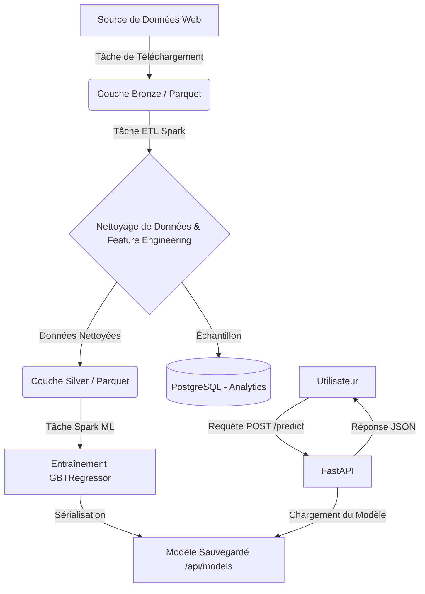

<div align="center">
  <br />
  
  <br /><br />

  <div>
    
    
    
    
    
    
  </div>

  <h1>Smart LogiTrack - Système de Prédiction ETA Basé sur l'IA</h1>
  <p><strong>Pipeline MLOps + Traitement Big Data + API REST + Authentification Sécurisée</strong></p>
</div>

---

## 1. Introduction

Un projet complet d'ingénierie de données et de machine learning conçu pour **prédire le temps d'arrivée estimé (ETA)** des transports urbains.

Le système orchestre un pipeline de données complexe : de l'ingestion des données brutes (couche Bronze) jusqu'au nettoyage des données (couche Silver), en passant par l'entraînement d'un modèle distribué **Spark ML** et son déploiement via un service **FastAPI** prêt pour la production.

### Architecture du Projet

```
Données Brutes (Parquet)
         ↓
Apache Airflow (Orchestrateur)
         ↓
Spark Submit - ETL & Nettoyage de Données (Spark SQL)
         ↓
Entraînement du Modèle (Gradient Boosted Trees)
         ↓
Volume Partagé - FastAPI (Inférence en Temps Réel)
```

---

## 2. Fonctionnalités Principales

### Orchestration & Ingénierie de Données (Airflow + Spark)

- **Pipeline Automatisé (DAG)** : Automatisation du téléchargement, ETL et entraînement
- **Nettoyage de Données** : Transformation Bronze vers Silver utilisant PySpark
- **Feature Engineering** : Calcul automatique de la durée et extraction temporelle
- **Gestion des Permissions** : Script robuste compatible avec les environnements Docker/WSL (atténuation des erreurs chmod)

### Machine Learning (Spark MLlib)

- **Modèle de Régression** : Gradient Boosted Trees (GBTRegressor)
- **Métriques d'Évaluation** : Calcul automatique du RMSE et R²
- **Persistance du Modèle** : Stockage du modèle sérialisé pour l'inférence

### Backend (FastAPI)

- **Authentification JWT** : Inscription et connexion sécurisées avec hachage Bcrypt
- **Service d'Inférence** : Chargement du modèle Spark au démarrage avec endpoint `/predict`
- **Analytics** : Endpoints basés sur SQL pour l'analyse des données historiques (ex : durée moyenne par heure)
- **Suite de Tests** : Tests unitaires et d'intégration complets avec Pytest

---

## 3. Métriques de Performance

### Performance du Modèle

| Métrique                   | Valeur              |
|----------------------------|---------------------|
| **RMSE** (Erreur Moyenne)  | ~4.69 minutes       |
| **R²** (Précision)         | 0.76 (76%)          |
| **Dataset d'Entraînement** | ~1.8M enregistrements |
| **Dataset de Test**        | ~469k enregistrements |

### Endpoints de l'API

| Endpoint       | Méthode | Auth Requise | Description                                    |
|----------------|---------|--------------|------------------------------------------------|
| `/register`    | POST    | Non          | Créer un compte utilisateur                    |
| `/token`       | POST    | Non          | Obtenir un token JWT                           |
| `/predict`     | POST    | Oui          | Estimer la durée du trajet (ETA)               |
| `/analytics/*` | GET     | Oui          | Données statistiques (moyennes horaires, etc.) |

---

## 4. Stack Technologique

### Data & Machine Learning

- **Apache Spark 3.5** : Moteur de traitement distribué
- **PySpark** : Interface Python pour Spark
- **Pandas** : Manipulation de données pour la couche API

### Backend & Base de Données

- **FastAPI** : Framework API asynchrone
- **SQLAlchemy** : ORM de base de données
- **PostgreSQL 16** : Système de base de données relationnelle
- **Pydantic** : Validation de données et gestion de schémas

### DevOps

- **Apache Airflow 2.9** : Orchestration de workflows
- **Docker & Docker Compose** : Conteneurisation et reproductibilité de l'environnement

---

## 5. Installation et Utilisation

### Prérequis

```bash
- Docker Desktop (ou Docker Engine)
- Docker Compose
- Minimum 4GB RAM recommandé (pour Spark et Airflow)
```

### Démarrage Rapide

#### Étape 1 : Cloner le Dépôt

```bash
git clone https://github.com/votre-username/smart-logitrack.git
cd smart-logitrack
```

#### Étape 2 : Lancer l'Environnement

```bash
# Construire les images et démarrer en mode détaché
docker-compose up --build -d
```

#### Étape 3 : Initialiser le Pipeline

- Accéder à l'interface Airflow : http://localhost:8080 (Utilisateur : admin / Mot de passe : admin)
- Activer le DAG `smart_logitrack_pipeline`
- Déclencher le DAG (cliquer sur le bouton de lecture)
- Attendre que toutes les tâches se terminent avec succès (statut vert)

### Points d'Accès aux Services

- **Interface Airflow** : http://localhost:8080
- **Documentation API (Swagger)** : http://localhost:8000/docs
- **Base de Données PostgreSQL** : Port 5432 (Utilisateur : user, Mot de passe : password, Base de données : taxidb)

---

## 6. Tests

La suite de tests vérifie l'authentification, la connectivité de la base de données et la fonctionnalité de réponse du modèle.

```bash
# Exécuter les tests à l'intérieur du conteneur API
docker-compose exec fastapi_app pytest
```

### Résultats Attendus

```
tests/test_api.py ... [100%]
================ 3 passed in 4.01s ================
```

---

## 7. Vue d'Ensemble du Workflow



---

## 8. Documentation Technique

### Structure du Projet

```
.
├── api/
│   ├── app/
│   │   ├── main.py          # Point d'entrée de l'API
│   │   ├── models.py        # Modèles SQLAlchemy
│   │   └── ...
│   ├── models/              # Volume partagé pour le modèle Spark
│   └── Dockerfile
├── dags/
│   └── project_dag.py       # Définition du pipeline Airflow
├── scripts/
│   ├── etl_silver.py        # Script Spark : Bronze vers Silver
│   └── train_model.py       # Script Spark : Entraînement ML
├── data/                    # Stockage local des données (Bronze/Silver)
└── docker-compose.yml       # Orchestration des services
```

---

## 9. Améliorations Futures

### Court Terme

- Implémenter une interface frontend (React ou Streamlit) pour la visualisation des prédictions
- Intégrer MLflow pour le suivi des expériences (RMSE, hyperparamètres)

### Moyen Terme

- Déployer un cluster Spark distribué (plusieurs workers) au lieu du mode local
- Implémenter un système de ré-entraînement automatique avec détection de drift

### Long Terme

- Déploiement en production sur Kubernetes (EKS/GKE) utilisant Helm Charts

---

## 10. Conclusion

Ce projet démontre la capacité à construire une architecture Data & IA robuste malgré les contraintes techniques (environnement Docker/WSL).

- **Pipeline ETL Résilient** : Gestion avancée des permissions de fichiers entre Linux/Windows
- **Architecture Microservices** : Séparation claire entre les couches d'orchestration, de calcul et de service
- **Sécurité** : Endpoints API protégés par JWT

Le système est entièrement fonctionnel de bout en bout et prêt pour une démonstration technique.

---

<div align="center">
  <p>Projet développé par <strong>Hamza Aslikh</strong> | Simplon Maghreb</p>
  <p>Janvier 2026</p>
</div>